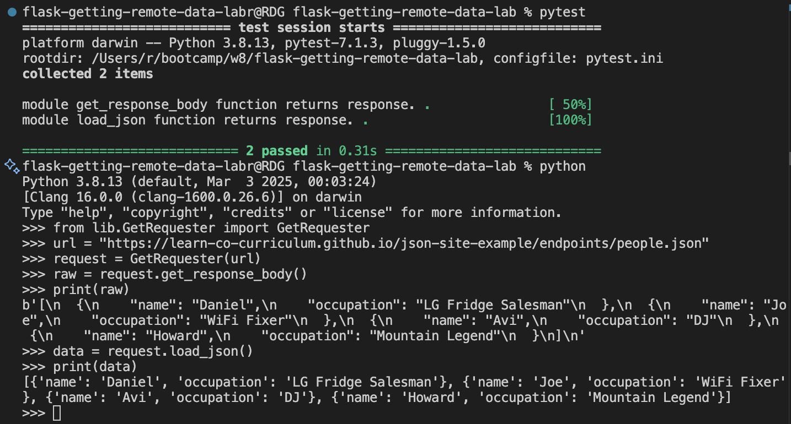

# Getting Remote Data Lab

This project implements a **`GetRequester`** class in Python that takes a URL on initialization, makes an HTTP GET request, and returns either the raw response bytes or a parsed JSON object.

## Table of Contents
- [Demo](#demo)  
- [Setup](#setup)  
- [Testing](#testing)  
- [Features](#features)  
- [Usage](#usage)
 

## Demo

## Setup
1. Fork & Clone the repo
2. Install dependencies: 
  `pipenv install`
  `pipenv shell`

---

## Testing
Run the existing test suite to validate functionality: `pytest`

---
## Features:

GetRequester class
  - get_response_body(): Sends an HTTP GET request, checks for errors, and returns raw bytes.
  - load_json(): Parses the raw bytes into Python dicts/lists using json.loads()
Error Handling: Raises an exception on non 2xx HTTP responses.

---

## Usage

Open Python REPL `python` and run the following commands: 

>>>`from lib.GetRequester import GetRequester`
>>>`url = "https://learn-co-curriculum.github.io/json-site-example/endpoints/people.json"`
>>>`request = GetRequester(url)`

#Get raw JSON bytes
>>>`raw = request.get_response_body()`
>>>`print(raw)`

#Parse JSON into Python data
>>>`data = request.load_json()`
>>>`print(data)`

